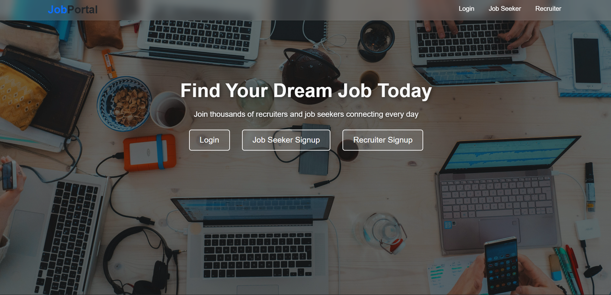
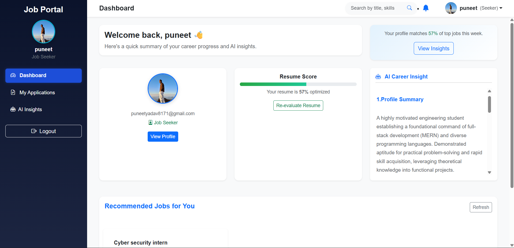

<h1 align="center">💼 Django Job Portal</h1>

  
  
  
  
  

  A full-stack <b>Django Job Portal</b> with AI-based resume insights powered by <b>Google Gemini API</b>, 
  background processing using <b>Celery + Redis</b>, and dynamic dashboards built with <b>AJAX</b>.

<h2>✨ Features</h2>
<ul>
  <li>👤 Multi-role authentication (Job Seeker & Recruiter)</li>
  <li>📄 Resume upload (PDF/DOCX) and parsing</li>
  <li>🤖 <b>AI Resume Insights</b> — strengths, weaknesses, suggestions (Gemini API)</li>
  <li>📬 Recruiter dashboard for posting and managing jobs</li>
  <li>📊 Job seeker dashboard showing applied jobs and AI feedback</li>
  <li>⚙️ Celery background workers for AI processing</li>
  <li>🧠 Redis as broker & result backend</li>
  <li>🔍 Job search & filtering by title, company, and skill</li>
  <li>💾 SQLite as the default development database</li>
</ul>

<h2>📁 Project Structure</h2>

<pre>
jobportal/
├── account/             # user authentication, seeker & recruiter profiles
├── jobs/                # job posting, application logic
├── dashboard/           # AI insights, analytics
├── static/              # CSS, JS, images
├── media/               # uploaded resumes
├── templates/           # HTML templates
├── manage.py
└── README.md
</pre>

<h2>⚙️ Setup & Installation</h2>

<ol>
  <li>Clone the repository:
    <pre><code>git clone https://github.com/yourusername/django-job-portal.git</code></pre>
  </li>
  <li>Move into the project directory:
    <pre><code>cd django-job-portal</code></pre>
  </li>
  <li>Create and activate a virtual environment:
    <pre><code>python -m venv venv
venv\Scripts\activate  # for Windows
source venv/bin/activate  # for macOS/Linux</code></pre>
  </li>
  <li>Install dependencies:
    <pre><code>pip install -r requirements.txt</code></pre>
  </li>
  <li>Apply migrations:
    <pre><code>python manage.py migrate</code></pre>
  </li>
  <li>Create a superuser:
    <pre><code>python manage.py createsuperuser</code></pre>
  </li>
  <li>Run the development server:
    <pre><code>python manage.py runserver</code></pre>
  </li>
  <li>Start Redis server (required for Celery):
    <pre><code>sudo service redis-server start
# or using Docker
docker run -d --name redis -p 6379:6379 redis</code></pre>
  </li>
  <li>Start Celery worker:
    <pre><code>celery -A jobportal worker --loglevel=info</code></pre>
  </li>
</ol>

<h2>🔑 Environment Variables</h2>

<pre><code>SECRET_KEY=your_secret_key
DEBUG=True
GEMINI_API_KEY=your_gemini_api_key
REDIS_URL=redis://127.0.0.1:6379/0
CELERY_BROKER_URL=${REDIS_URL}
CELERY_RESULT_BACKEND=${REDIS_URL}
</code></pre>

<h2>📸 Screenshots</h2>

  
  
  

<h2>🧠 Tech Stack</h2>
<ul>
  <li><b>Backend:</b> Django 5 (Python)</li>
  <li><b>Database:</b> SQLite (default)</li>
  <li><b>Task Queue:</b> Celery + Redis</li>
  <li><b>AI Service:</b> Google Gemini API</li>
  <li><b>Frontend:</b> HTML, CSS, JavaScript (AJAX)</li>
</ul>

<h2>🚀 Key Highlights</h2>
<ul>
  <li>✅ AI-powered resume insights </li>
  <li>✅ Real-time AJAX dashboards</li>
  <li>✅ Asynchronous processing with Celery</li>
  <li>✅ Lightweight and easily deployable (uses SQLite by default)</li>
</ul>

<h2>🤝 Contributing</h2>

Want to improve this project? Fork it, make your changes, and open a pull request!

<pre><code>git clone https://github.com/yourusername/django-job-portal.git
git checkout -b feature-name
git commit -m "Add new feature"
git push origin feature-name
</code></pre>

<h2>📜 License</h2>

This project is licensed under the <b>MIT License</b>.

<h2 align="center">⭐ Star this repo if you like the project!</h2>
